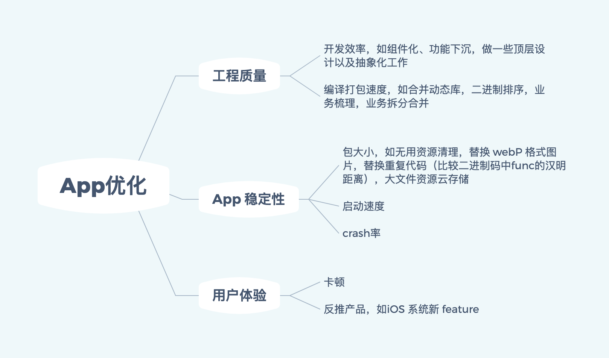

<!-- TOC -->

- [iOS](#ios)
    - [Swift](#swift)
    - [基础](#基础)
    - [进阶](#进阶)
    - [应用](#应用)
- [前端](#前端)
    - [基础](#基础-1)
- [算法&数据结构](#算法数据结构)
- [网络相关知识](#网络相关知识)
- [设计模式 & 架构](#设计模式--架构)
- [项目经验(主要根据项目情况问问题)](#项目经验主要根据项目情况问问题)
- [\#Q&A](#\qa)
    - [抽象类与接口的区别](#抽象类与接口的区别)
    - [optional原理与实现机制](#optional原理与实现机制)
    - [方法交换（swizzle）应该放在哪里执行](#方法交换swizzle应该放在哪里执行)
    - [swift快在哪儿](#swift快在哪儿)
    - [KVC和KVO的keyPath—定是属性么](#kvc和kvo的keypath定是属性么)
    - [App优化](#app优化)
    - [关于swift与OC多说两句](#关于swift与oc多说两句)
    - [HTTP的三次握手和四次挥手以及为什么挥手是四次](#http的三次握手和四次挥手以及为什么挥手是四次)
    - [悬垂指针、野指针分别指什么](#悬垂指针野指针分别指什么)
    - [HLS/RTSP/RTMP/WebRTC流媒体协议的区别](#hlsrtsprtmpwebrtc流媒体协议的区别)
    - [float与double](#float与double)
    - [SQLite、WCDB、Realm使用，及其优缺点？](#sqlitewcdbrealm使用及其优缺点)
    - [atomic 实现原理，及使用atomic是否能保证线程安全?](#atomic-实现原理及使用atomic是否能保证线程安全)
    - [是不是所有对象都有`pool`进行管理，什么对象由`pool`进行管理？](#是不是所有对象都有pool进行管理什么对象由pool进行管理)
    - [iOS中保证线程安全的方法？](#ios中保证线程安全的方法)
    - [`Swift`中的`Error`与`OC`的`NSError`相互转化时发生了什么?](#swift中的error与oc的nserror相互转化时发生了什么)
    - [layoutSubviews在以下情况下会被调用](#layoutsubviews在以下情况下会被调用)
    - [block 实现原理](#block-实现原理)
    - [优先级反转](#优先级反转)
    - [app 进程间通信方式](#app-进程间通信方式)
    - [TCP 的可靠性如何保证](#tcp-的可靠性如何保证)
    - [OC支持方法重载吗？为什么？](#oc支持方法重载吗为什么)

<!-- /TOC -->
## iOS

#### Swift

1. 为什么 Apple 建议使用 `Struct`？有何特性？与 `Class` 对比好处在哪里？平常使用多么？ 为什么？★★★☆☆ 
2. swift的具有快速、安全、简洁的特点，[swift快在哪儿](#swift快在哪儿)？
3. 高阶函数`map`、 `flatmap`、 `reduce`、 `filter`作用  `(进阶：自己实现map函数应该如何实现)`★★☆☆☆ 
4. `String` 和 `NSString` 的区别和联系★★☆☆☆ 
5. `associatedType` 的作用？简述其与泛型的区别★★☆☆☆ 
6. `open`和`public`的区别★★☆☆☆ 
7. 闭包与函数的区别★★☆☆☆ 
8. [`optional`原理与实现机制](#optional原理与实现机制) ★★☆☆☆ 
9. 定义静态方法时关键字`static`和`class`有什么区别? ★☆☆☆☆ 
10. [`Swift`中的`Error`与`OC`的`NSError`相互转化时发生了什么?](#`Swift`中的`Error`与`OC`的`NSError`相互转化时发生了什么? )★★★☆☆ 
11. `Swift method dispatch` ★★★☆☆ 
12. [swift 单例的实现，是如何保证线程安全的](https://juejin.im/post/59e30701f265da432f3026ad)★★☆☆☆ 
13. [关于swift与OC多说两句](#关于swift与OC多说两句)

#### 基础

1. `weak` 和 `assign` ★★☆☆☆
2. `alloc` 与 `init` 分别作了什么？★★☆☆☆
3. [悬垂指针、野指针分别指什么？](#悬垂指针、野指针分别指什么)
4. `weak`原理和实现★★★☆☆
5. 什么时候使用`copy`修饰符? ★★☆☆☆
6.  @synchronized 原理★★★☆☆ 
7. `property(copy, nonautomic) NSMutableArray *array`;会出现什么问题? ★★☆☆☆ 
8. 介绍一下对深拷贝和浅拷贝的理解★★★☆☆ 
9. `ARC`和 `MRC`的区别 ★★★☆☆ 
10. `ARC`和 `GC`的区別 ★★★☆☆

  - 平时怎么使用 `AutoreleasePool`? ★★★☆☆
  - 不手动指定`AutoreleasePool`的前提下，一个`AutoreleasePool`对象在什么时刻释放? (比如在一个VC的`viewDidLoad`中创建的局部变里) ★ ★ ★ ☆ ☆ 
9. `AutoreleasePool` 和 `RunLoop` 有什么关系? ★★★★☆
10. [是不是所有对象都有`pool`进行管理，什么对象由`pool`进行管理？](#是不是所有对象都有`pool`进行管理，什么对象由`pool`进行管理？)
11. 介绍一下对`RunLoop`的认识和几种[Timer](https://www.cnblogs.com/xyq-208910/p/6590829.html)★★★☆☆
12. `RunLoop`和线程有什么关系? ★★★☆☆
13. 猜想一下`RunLoop`内部是如何实现的? ★★★★☆
14. 0C中self和super有什么关系? ★★★☆☆
15. 为什么`block`可以修改使用block修饰的局部变里昵?(延伸问题:为什么苹果没有设计成默认加上_block )★★★★☆ 
16. `NSTimer`循环引用`self`的问题怎么解决?★★☆☆☆ 
 17. 使用`GCD`或`UlView.animate`相关的`api`时，是否考虑引用循环问题? ★★★☆☆

     - GCD`的队列分为哪两种?

     - `dispatch_barrier_async` 有什么作用? ★★★☆☆
18. 介绍一下`iOS ResponseChain` (事件响应链)★★★★☆ 
19. 进程、线程和协程的区别★★☆☆☆ 
20. [iOS中保证线程安全的方法？](#iOS中保证线程安全的方法？)
21. [OC支持方法重载吗？为什么？](#OC支持方法重载吗？为什么？)

#### 进阶

1. `reloadData()`做了什么？（`runtime`相关）★★★★★
2. [`block` 实现原理](#block 实现原理) ★★★★★
3. `GCD` 线程池 ★★★★☆
4. `NSObject` 与 `NSProxy` 的区别？★★★☆☆
5. [`float`与`double`有效位，为什么0.1+0.2>0.3](#float与double)
6. `Objective-C`的消息处理流程★★★★☆
7. [`atomic` 实现原理，及使用atomic是否能保证线程安全?](#atomic 实现原理，及使用atomic是否能保证线程安全?)★★★☆☆
8. 渲染 jpeg 时怎么知道内存大小★★★★☆
9. 如何设计一个运行时检测内存泄漏的框架★★★★☆
10. 进程间通信的常用方式★★★☆☆
11. [什么是优先级反转？如何解决](#优先级反转)？★★★★☆
12. RXSwift实现原理，如何完成双向绑定？★★★★☆
13. CoreGraphic 能否使用多线程进行绘制？★★★★☆
14. retainCount 保存在哪里？★★★★☆

#### 应用

1. 如何手动触发一个`value`的`KVO`? ★★★☆☆ 
2. [`KVC`和`KVO`的`keyPath` —定是属性么?](#KVC和KVO的keyPath—定是属性么) ★★★☆☆ 
3. OC语言如何是管理内存? 如何检测内存泄漏? 有几种方式？
4. `IBOutlet`连出来的视图属性为什么可以被设置成`weak` ?★★☆☆☆ 
5. [`layoutSubviews` 调用时机](#layoutSubviews在以下情况下会被调用)★★★☆☆ 
6. `drawRect` 调用时机★★★☆☆
7. `lldb(gdb)`常用的调试命令? ★★★☆☆ 
8. 对比一下`GPU`和`CPU`绘制情况★★★☆☆ 
9. `CGxxx`类的方法使用`GPU`还是`CPU`绘制? ★★★☆☆ 
10. 介绍一下对`离屏渲染`的理解★★★★☆ 
11. 只要屏幕上有任何手势操作都需要执行一个单例对象的方法，如何做？★★★☆☆ 
12. 如何保证IM 消息的时序性和到达率？★★★☆☆ 
13. 若要加载多张图片，然后合并成一张整图，用`GCD`怎么做? ★★★☆☆ 
14. 设计一个图文混排的方案？有何注意要点？★★★★☆
15. 如何让 `NSMutableArray`线程安全? ★★★☆☆ 
16. [方法交换（swizzle）应该放在哪里执行？为什么？](#方法交换（swizzle）应该放在哪里执行)★★☆☆☆
17. 简述一下 OC 和 JS 相互调用的几种方式？[这里](https://juejin.im/post/5a95272f5188257a585113a3) [还有这里]([https://xiaovv.me/2017/04/15/iOS%E4%B8%8BJS%E4%B8%8ESwift%E4%BA%92%E7%9B%B8%E8%B0%83%E7%94%A8%EF%BC%88%E5%9B%9B%EF%BC%89JavaScriptCore/](https://xiaovv.me/2017/04/15/iOS下JS与Swift互相调用（四）JavaScriptCore/))★★★★☆
18. [如何设计一个图片缓存框架？](https://www.jianshu.com/p/419681149cdf)★★★★☆
19. [SQLite、WCDB、Realm使用，及其优缺点？](#SQLite、WCDB、Realm使用，及其优缺点？)★★★★☆

   ​    

## 前端

#### 基础

虚拟DOM与dom对比


## 算法&数据结构

1. 创建一个链表并翻转★★★☆☆ 

2. 如何判断链表是否有环★★☆ ☆☆ 

3. 介绍一下常见的几个排序算法的优缺点★★★☆☆ 

4. 求两个集合的交集★★★☆☆ 

5. 一个字符数组，求其所有的排列组合★★★☆☆ 

6. 二叉树是否相等★★★☆☆ 

7. 使用两个队列模拟栈如何做★★★☆☆ 

8. 快速排序是否稳定? 能否手写快排★★★★☆

9. 计算一个二叉树的最大深度与最大广度★☆☆☆☆

    

## 网络相关知识

1. `HTTP` 的结构★★☆☆☆

2. `HTTP`和`HTTPS`的区别★★☆☆☆

3. [HLS/RTSP/RTMP/WebRTC 流媒体协议的区别](#HLS/RTSP/RTMP/WebRTC流媒体协议的区别)★★★☆☆

4. 为 什么 `HTTPS`更安全?简述HTTPS握手过程与加密★★☆☆☆

5. Websocket 和 sockect 的区别[[简述](https://juejin.im/post/5c974855e51d4572f05e110a)]★★★★☆

6. `HTTP2` 了解么? ★★☆☆☆ 

7. 什么是中间人攻击？★★★☆☆

8. Dns 解析的风险 劫持跟踪和欺诈★★★★☆

9. [HTTP的三次握手和四次挥手以及为什么挥手是四次？](#HTTP的三次握手和四次挥手以及为什么挥手是四次)★★★☆☆

10. 在浏览器地址栏里输入一个`URL`到显示出页面，中间都发生了什么? ★★★★☆

11. [TCP 如何保证可靠性的？](#TCP 的可靠性如何保证)★★★☆☆

     

## 设计模式 & 架构

1. **`MVC`、`MVVM`、`VIPER`** 优缺点★★★☆☆ 

2. 工程组件化方案★★★★☆

3. 简单工厂和抽象工厂的区别★★★☆☆ 

4. [抽象类与接口的区别](#抽象类与接口的区别)★★★☆☆ 

5. app模块化与路由（模块间通信）★★★★☆

    

## 项目经验(主要根据项目情况问问题)

- 项目中遇到的技术难点有哪些，怎么解决的? 
- 数据持久化方案★★★★☆
-  [`App`优化（启动优化和性能优化）](#App优化)★★★☆☆ 


## \#Q&A

> 说明：解答部分为个人理解加工，非标准答案


#### 抽象类与接口的区别

​	抽象类是对`具体事物`的抽象，接口是对一类`属性`/`动作`的抽象。

​	当确定有一类事物，但不知具体有什么实例化（例如Object、vehicle），用抽象类；当描述一类特性的时候，用接口（例如 Movable， Flyable）


#### optional原理与实现机制

​	optional底层实现为枚举，模拟实现：

```swift
enum Optional<T> {    
  case some(T)   //对于所有成功的情况，我们用case some，并且把成功的结果保存在associated value里；
  case none      //对于所有错误的情况，我们用case none来表示；
}
```


#### 方法交换（swizzle）应该放在哪里执行

​	方法交换应保证在程序运行期间只执行一次，从这个角度来讲，将其放在单例，或者类的load()方法中皆可。


#### swift快在哪儿

swift更快时相比于OC来说的，表现在编译期、函数派发、内存布局上的速度提升

1. 编译期

   swift 采用的是类似 C++ 的编译时的多态技术，相比于运行时多态技术，会减少一些额外的计算，缺点是会使二进制包大一些

   swift编译过程中，生成的SIL中间语言会对swift有针对性的优化（swift编译过程：swift->SIL->LLVM IR->汇编->二进制文件，其中IR中间代码与语言无关，为swift跨平台提供了可能）

2. 函数派发

   swift 支持静态派发，函数表派发， messageSend 机制派发 

   静态派发又叫直接派发，函数在编译期就确定了地址，swift中 extension里的函数就是直接派发，还有一些编译期优化的inline函数也是直接派发

   函数表派发主要通过v-table（swift中叫witnessTable）派发

   messageSend OC中通过cacheList可以达到和函数表派发效率差不多的效果

3. 内存布局

   swift 中大量使用struct ，因为struct是栈区内存管理，栈区的数据操作直接通过cpu提供的指令寄存器，天然比堆区内存快很多

   

#### KVC和KVO的keyPath—定是属性么

不一定，OC中成员变量也是可以的。
处注意属性与成员变量的区别，OC中使用@property时，实际声明的为一个计算属性，编译器会为属性生成setter()与getter(), 并会为该属性添加@sythesize生成带下划线的对应存储属性（即成员变量），典型的能说明这个问题的场景是：如果同时重写了setter与getter 必须提供一个自己实现的成员变量，否则会报错。
此题容易扩展sythesize关键字作用，及如何手动触发KVO

[深入理解](https://juejin.im/entry/5bea93345188256d014d5fa9)


#### App优化



**App启动流程：** 

> 1. 加载info.plist
>2. 创建沙盒
> 3. 权限检查
> 4. 库链接

**App初始化流程:**

> 1. `main` 函数
>2. 执行`UIApplicationMain`      
> 3. 创建`UIApplication`对象
>   2. 创建`UIApplication`的`delegate`对象
>    3. 创建`MainRunloop`
>    4.  `delegate`对象开始处理(监听)系统事件(没有`storyboard`)
>4. 根据`Info.plist`获得最主要`storyboard`的文件名,加载最主要的`storyboard`(有`storyboard`)
> 5. 程序启动完毕的时候,  就会调用代理的`application:didFinishLaunchingWithOptions:`方法在`application:didFinishLaunchingWithOptions:`中创建`UIWindow` 创建和设置`UIWindow`的rootViewController
>6. 最终显示第一个窗口


#### HTTP的三次握手和四次挥手以及为什么挥手是四次

之所以握手三次，是因为在第二次握手中，服务器同时将syn与ack发送给客户端，即将两次握手过程在一次完成


#### 悬垂指针、野指针分别指什么

基本属于语义的区别：

- **悬垂指针**：当所指向的对象被释放或者收回，但是对该指针没有作任何的修改，以至于该指针仍旧指向已经回收的内存地址，此情况下该指针便称**悬垂指针**（也叫**迷途指针**）。

- **野指针：**某些编程语言允许**未初始化**的指针的存在，而这类指针即为**野指针**。


#### HLS/RTSP/RTMP/WebRTC流媒体协议的区别

HLS（ HTTP Live Streaming）苹果公司提出的流媒体协议，直接把流媒体切片成一段段，信息保存到 m3u 列表文件中，可以将不同速率的版本切成相应的片。播放器可以直接使用 HTTP 协议请求流数据，可以在不同速率的版本间自由切换，实现无缝播放，省去使用其他协议的烦恼。缺点是延迟大小受切片大小影响，不适合直播，适合视频点播。

RTSP （Real-Time Stream Protocol）由 Real Networks 和 Netscape 共同提出的，基于文本的多媒体播放控制协议。RTSP 定义流格式，流数据经由 RTP 传输。RTSP 实时效果非常好，适合视频聊天、视频监控等方向。

RTMP（Real Time Message Protocol） 由 Adobe 公司提出，用来解决多媒体数据传输流的多路复用（Multiplexing）和分包（packetizing）的问题，优势在于低延迟，稳定性高，支持所有摄像头格式，浏览器加载 Flash 插件就可以直接播放。

总结：
HLS 延迟大，适合视频点播；RTSP 虽然实时性最好，但是实现复杂，适合视频聊天和视频监控；RTMP 强在浏览器支持好，加载Flash 插件后就能直接播放，所以非常火，相反在浏览器里播放 RTSP 就很困难了。


#### float与double

- 单精度浮点数 `float` 总共包含 32 位，其中 1 位表示符号、8 位表示指数，最后 23 位表示小数；

- 双精度浮点数 `double` 总共包含 64 位，其中 1 位表示符号，11 位表示指数，最后 52 位表示小数；

  [详细说明](https://mp.weixin.qq.com/s/M2m3haos2OebXyXFzTc_6A)


#### SQLite、WCDB、Realm使用，及其优缺点？

- SQLite 仅提供基本功能，需要手写SQL
- WCDB 提供ORM，连接池，可通过OO方式操作
- Realm 同上


#### atomic 实现原理，及使用atomic是否能保证线程安全?

在 [objc4-723](https://link.zhihu.com/?target=https%3A//opensource.apple.com/) 的 Objective-C runtime 实现中，property 的 atomic 是采用 spinlock_t 也就是俗称的自旋锁实现的。

```objective-c
// getter
id objc_getProperty(id self, SEL _cmd, ptrdiff_t offset, BOOL atomic) 
{
    // ...
    if (!atomic) return *slot;

    // Atomic retain release world
    spinlock_t& slotlock = PropertyLocks[slot];
    slotlock.lock();
    id value = objc_retain(*slot);
    slotlock.unlock();
    // ...
}

// setter
static inline void reallySetProperty(id self, SEL _cmd, id newValue, ptrdiff_t offset, bool atomic, bool copy, bool mutableCopy)
{
    // ...
    if (!atomic) 
{
        oldValue = *slot;
        *slot = newValue;
    } 
else 
{
        spinlock_t& slotlock = PropertyLocks[slot];
        slotlock.lock();
        oldValue = *slot;
        *slot = newValue;        
        slotlock.unlock();
    }
    // ...
}
```

atomic通过这种方法，在运行时保证 set,get方法的原子性。
仅仅是保证了set,get方法的原子性。
**这种线程是不安全的。**

```objective-c
@property (atomic, assign)    int       intA;

//线程A
for (int i = 0; i < 10000; i ++) 
{
    self.intA = self.intA + 1;

    NSLog(@"Thread A: %d\n", self.intA);
}

//线程B
for (int i = 0; i < 10000; i ++) 
{
    self.intA = self.intA + 1;

    NSLog(@"Thread B: %d\n", self.intA);
}
```

self.intA 是原子操作，但是self.intA = self.intA + 1这个表达式并不是原子操作。
所以线程是不安全的。
threadA 在执行表达式 self.intA之后 self.intA = self.intA + 1;并没有执行完毕
此时threadB 执行self.intA = self.intA + 1;
再回到threadA时，self.intA的数值就被更新了

所以仅仅使用atomic并不能保证线程安全。


#### 是不是所有对象都有`pool`进行管理，什么对象由`pool`进行管理？

- 当使用`alloc/new/copy/mutableCopy`开始的方法进行初始化时，会**生成并持有对象**(也就是不需要`pool`管理，系统会自动的帮他在合适位置`release`)；对于类方法，及一些工厂方法，或对象作为其他方法的返回值，则由autoreleasePool管理。

- `__weak`修饰符只持有对象的弱引用，而在访问引用对象的过程中，该对象可能被废弃。那么如果把对象注册到`autorealeasepool`中，那么在`@autorealeasepool`块结束之前都能确保对象的存在。

  > 最新的情况是weak修饰的对象不会再被加入到Pool中了[参考](https://stackoverflow.com/questions/40993809/why-weak-object-will-be-added-to-autorelease-pool)


#### iOS中保证线程安全的方法？

- 加锁(互斥锁、自旋锁...)

  > NSLock、NSCondition

-  @synchronized

- atomic

-  GCD

  > dispatch_barrier_asynca、dispatch_semaphore...

[参考](https://juejin.im/post/5bf21d935188251d9e0c2937)


#### `Swift`中的`Error`与`OC`的`NSError`相互转化时发生了什么?

Error 只是一个protocol，不提供实现， NSError为继承自NSObject的class。


#### layoutSubviews在以下情况下会被调用

1. init初始化不会触发layoutSubviews
    但是是用initWithFrame 进行初始化时，当rect的值不为CGRectZero时,也会触发

2. addSubview会触发layoutSubviews

3. 设置view的Frame会触发layoutSubviews，当然前提是frame的值设置前后发生了变化

4. 滚动一个UIScrollView会触发layoutSubviews

5. 旋转Screen会触发父UIView上的layoutSubviews事件

6. 改变一个UIView大小的时候也会触发父UIView上的layoutSubviews事件

在苹果的官方文档中强调:

```kotlin
  You should override this method only if the autoresizing behaviors of the subviews do not offer the behavior you want.
```

> layoutSubviews, 当我们在某个类的内部调整子视图位置时，需要调用。
>  反过来的意思就是说：如果你想要在外部设置subviews的位置，就不要重写。


#### block 实现原理

block 通过 struct 实现， 其中含有 isa 指针，本质上是个结构体。

block 共有三种类型，`_NSGlobalBlock__`、`__NSStackBlock__`、`__NSMallocBlock__`，根据捕获变量类型进行区分

_NSGlobalBlock__：存储在静态区， 捕获静态局部或者全局变量

_NSStackBlock__：存储在栈区，捕获局部变量

_NSMallocBlock__: 存储在堆区，编译器会根据情况复制栈区 block 到堆区，分为以下四种情况

- **Block作为函数返回值时**
- **将block赋值给强指针时**
- **当block作为参数传给Cocoa API时**
- **block作为GCD的API的参数时**


#### 优先级反转

1. 什么是优先级反转(Priority Inversion)
   由于多进程共享资源，具有最高优先权的进程被低优先级进程阻塞，反而使具有中优先级的进程先于高优先级的进程执行，导致系统的崩溃。这就是所谓的优先级反转(Priority Inversion)。

2. 产生原因
    其实,优先级反转是在高优级(假设为A)的任务要访问一个被低优先级任务(假设为C)占有的资源时,被阻塞.而此时又有优先级高于占有资源的任务(C)而低于被阻塞的任务(A)的优先级的任务(假设为B)时,于是,占有资源的任务就被挂起(占有的资源仍为它占有),因为占有资源的任务优先级很低,所以,它可能一直被另外的任务挂起.而它占有的资源也就一直不能释放,这样,引起任务A一直没办法执行.而比它优先低的任务却可以执行.  

3. 解决方案 ( 优先级继承 / 优先级天花板 )


   目前解决优先级反转有许多种方法。其中普遍使用的有2种方法：一种被称作优先级继承(priority inheritance)；另一种被称作优先级极限(priority ceilings)。

    A. 优先级继承(priority inheritance) 
    优先级继承是指将低优先级任务的优先级提升到等待它所占有的资源的最高优先级任务的优先级.当高优先级任务由于等待资源而被阻塞时,此时资源的拥有者的优先级将会自动被提升.  
    
    B. 优先级天花板(priority ceilings)
    优先级天花板是指将申请某资源的任务的优先级提升到可能访问该资源的所有任务中最高优先级任务的优先级.(这个优先级称为该资源的优先级天花板)  


#### app 进程间通信方式

- URL Scheme

- Keychain

- UIPasteboard

- UIDocumentInteractionController

- local socket

- AirDrop

- UIActivityViewController

- App Groups

  [详情](https://blog.csdn.net/kuangdacaikuang/article/details/78891379#1-url-scheme)
  
  

#### TCP 的可靠性如何保证

- 检验和

- 超时重传

- 最大消息长度

- 滑动窗口控制

- 拥塞控制

- 慢启动

  [详解](https://zhuanlan.zhihu.com/p/112317245)
  
  

#### OC支持方法重载吗？为什么？

OC 不持之方法重载。

这是由 OC 中方法的查找过程决定的，OC 中在 methodList 查找到对应方法后便后返回，并不会去验证方法的参数类型和个数。